# F1 Statistics - CI Project 3

This website was created as a third portfolio project for Code Institute's Diploma in Web Application Development. The site was inspired by my interest in FORMULA 1 as a sport and a desire to have easily accesible information.

The website can be [found here](https://formula-one-statistics.herokuapp.com/).

## Table of Contents

- [Objective](#objective)
- [UX and UI](#ux-and-ui)
  - [Site Owner Goals](#site-owner-goals)
  - [User Stories](#user-stories)
  - [Wireframes](#wireframes)
- [Design](#design)
  - [Background](#background)
  - [Colours](#colours)
  - [Favicon](#favicon)
- [Logic](#logic)
  - [Flowchart](#flowchart)
- [Features](#features)
  - [Home Page](#home-page)
  - [Auth](#auth)
    - [Login](#login)
    - [Register](#register)
    - [Logout](#logout)
  - [Note For Sections Below](#note-for-sections-below)
  - [Circuits](#circuits)
    - [Circuit Overview](#circuit-overview)
    - [Circuit View](#circuit-view)
  - [Constructors](#constructors)
    - [Constructor Overview](#constructor-overview)
    - [Constructor View](#constructor-view)
  - [Drivers](#drivers)
    - [Driver Overview](#driver-overview)
    - [Driver View](#driver-view)
  - [Races](#races)
    - [Race Overview](#race-overview)
    - [Race View](#race-view)
      - [Qualifying Results](#qualifying-results)
      - [Race Results](#race-results)
      - [Driver Standings](#driver-standings)
      - [Constructor Standings](#constructor-standings)
  - [Seasons](#seasons)
    - [Season Overview](#season-overview)
    - [Season View](#season-view)
  - [Profile](#profile)
    - [Favourites](#favourites)
    - [Change Password](#change-password)
    - [Delete Account](#delete-account)
  - [Admin Dashboard and Admin Edit](#admin-dashboard-and-admin-edit)
    - [Add Circuit](#add-circuit)
    - [Add Constructor](#add-constructor)
    - [Add Driver](#add-driver)
    - [Add Race](#add-race)
    - [Add Season](#add-Season)
    - [Edit Driver](#edit-driver)
    - [Edit Race](#edit-race)
    - [Manage Users](#manage-users)
  - [404 Page](#404-page)
  - [Footer](#footer)
- [Features to Add](#features-to-add)
- [Deployment](#deployment)
- [Testing](#testing)
  - [Validator Testing](#validator-testing)
  - [Manual Testing](#validator-testing)
- [Credits](#credits)
  - [Languages](#languages)
  - [Frameworks, Libraries and Tools](#frameworks-libraries-and-tools)
  - [Images](#images)

## Objective

#

## UX and UI

- ### Site Owner Goals

  The goal of the site for the owner is to:

  1. Create a home for data from all FORMULA 1 circuits, constructors, drivers, races and seasons.
  2. Allow users to easily navigate the site and allow them to save things to their favourites to allow easy access later.
  3. Have an easy way to add data to the database once an event has finished.

#

- ### User Stories

  - #### First Time Visitor Goals

    1. As a first time user, I want to immediately understand the purpose of the website and how to get started.
    2. As a first time user, I want to be able to easily navigate the site, with a clear indication of which page I am currently on.
    3. As a first time user, I want easy access to external information, where available, to content that I find interesting.

  - #### Returning Visitor Goals

    1. As a returning visitor, I want to be able to access any content I've added to my favourites easily, without needing to search for it directly.
    2. As a returning visitor, I want to be able to manage my account by changing my display name, password or deleting my account entirely.

  #

  ## Wireframes

  The wireframes for this site were created using Balasmiq, with each section and subsection noted.

  The sections below show individual wireframes for different devices, covering the home page when not logged in, the profile page once logged in and a generic overiew of most pages on the site.

   

    
Wireframe - Home & Profile

  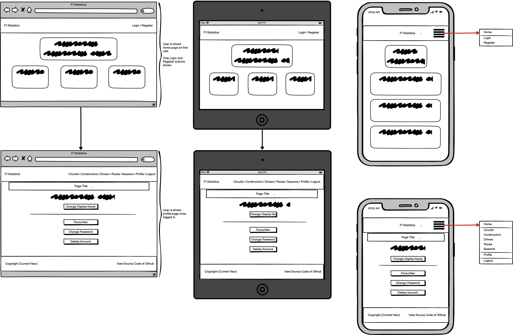
    

    

    
Wireframe - Other Pages

  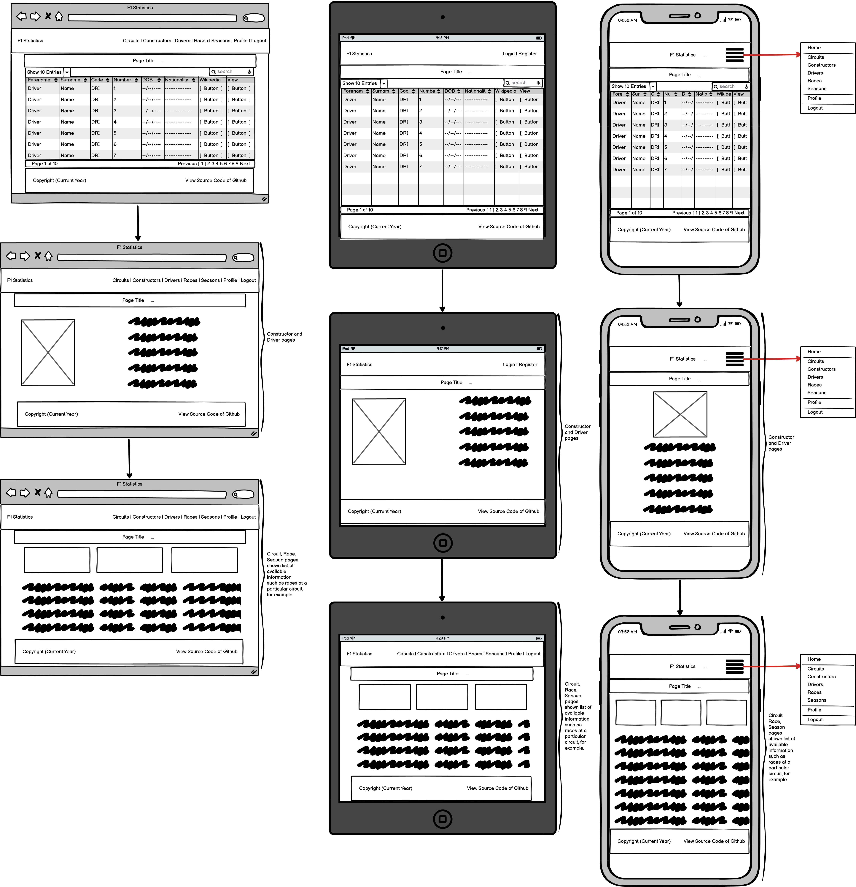
    

  The directory containing the wireframe images can be found [here](docs/wireframes/).

#

## Logic

- ## Flowchart

     

    
Show Flowchart

  
    

I spent time thinking about the logic and flow of the site to make sure I had a rough idea of how things were to be laid out and how each part of the site would interact with the database. The flowchart was created using [Lucidchart](https://lucid.app/).

#

## Design

- ## Background

  I made use of the tool available at [SVG Backgrounds](https://www.svgbackgrounds.com/) for this site for a number of reasons.

  - Due to the background being a scalable vector graphic, it will not lose sharpness or quality as the screen size increases and will remain responsive.
  - Due to being an SVG, the file size of the entire background is around 5kb, greatly reducing the total size of the assets required on page load.
  - The tool offers a large amount of customisation and is free for use, as long as attribution is given.
  - The colour of the background chosen has high contrast against the predominantly grey colour scheme of the main game.

- ## Colours

#

-  - `#b71c1c` - This colour was chosen for the navbar and footer as a subtle nod to the main colour of the official FORMULA 1 logo.
-  - `#03a9f4` - This colour is used for the icons on the main page and was chosen as it contrasts well against the striking red colour of the navbar.
-  - `#01579b` - This colour was used for the submit buttons at the bottom of the pages for editing drivers & races. This colour was chosen as it contrasts well against the  white background of the main section, and also against the footer of the page which, as described above, uses the colour  `#b71c1c`.

#

The below colours were not chosen by myself, but are the default colours chosen for the background used from the site [SVG Backgrounds](https://www.svgbackgrounds.com/). I decided to stick with the default colours of the theme chosen due to the close resemblance with the current livery of the [Williams team](https://www.google.com/search?q=Williams+2022+livery&tbm=isch).

-  - `#002222`
-  - `#002266`
-  - `#001133`

#

- ## Favicon

  The website [Favicon.io](https://favicon.io/) was used to generate the favicon image for the website. The chequered flag Unicode emoji , 🏁, was chosen as the icon as it is relative to the theme of the website and is recognisable due to its association with and use in motorsport.

#

# Features

- ## Home Page

  Upon first accessing the site the user is shown the home page which contains 3 main elements.

1.  Navbar

    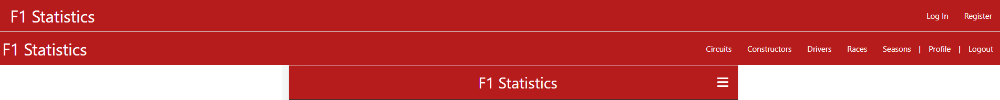

    The navbar is shown on all pages and is part of the base.html template. The navbar has 3 different configurations.

- If no user session exists the navbar displays the title of the site on the left side, 'F1 Statistics', and links to either 'Login' or 'Register' on the right side. Alternatively, on mobile devices a hamburger menu icon is shown, with a side nav appearing when pressed.
- If a user session exists, the navbar displays the title of the site on the left side, 'F1 Statistics', and links to all content options and the users profile, as well as the option to log out on the right. Alternatively, on mobile devices a hamburger menu icon is shown, with a side nav appearing when pressed.
- If the admin user is logged in, the navbar displays the title of the site on the left side, 'F1 Statistics', and links to all content options and access to the admin dashboard, as well as the option to log out on the right. Alternatively, on mobile devices a hamburger menu icon is shown, with a side nav appearing when pressed.

#

2.  Hero Section

    

    The hero section contains the main content of the page. It is contained within a div styled with a background of  `RGBA(89,89,89,0.712)` to contrast it against the background and maintain readability, with a WCAG (Web Content Accessibility Guidelines) score of 7:1, or Level AAA.

    The section welcomes the user to the site, also containing the name of the site, gives a brief description of the purpose of the website, and clear instructions on the actions the user should take next with emphasis also given to clickable links.

3.  Info Section

    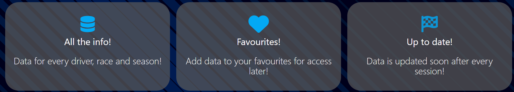

    The info section contains 3 seperate divs containing information about the site. The divs are styled with the same background detailed in the hero section, but also each contain animated icons to draw the users attention to the main benefits of using the site. These icons were provided by Font Awesome and have a colour of  - `#03a9f4` applied as this matches with the background of the main page, but also provides sufficient contrast to remain easily viewable, although the icons themselves are not an important part of the content of the page.

- ## Auth

  - Login

    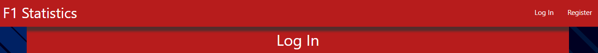

    The Login page has intentionally been kept as simple as possible to direct the actions by the user without the need for any additional instructions.

    The first noticable difference, and a theme throughout the rest of the site is a div displaying the title of the page. This was achieved by using Jinja2 templating and the use of `` at the head of the page.

    The colour of the login div was intentionally kept the same as that of the navbar, but a shadow was applied to the top of the div to provide some separation between the elements.

    #

    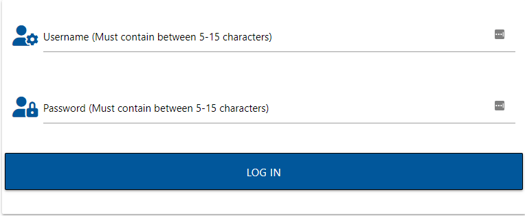

    Directly below the header of the page is the form allowing the user to login. The form contains 3 main elements - Username, Password and the login button itself.

    Both the Username and Password fields have been given the following pattern of `^[a-zA-Z0-9]{5,15}$` which has the requirements of:

    - Only containing alphanumeric characters.
    - A minimum length of 5 characters.
    - A maximum length of 15 characters.

    Both fields are marked as required and are validated when the user clicks the 'Log In' button.

    The input field for Username and Password are underlined red whilst the minimum or maximum length requirements are not met, with a tooltip being displayed to the user if they try to submit an invalid form, as shown below.

    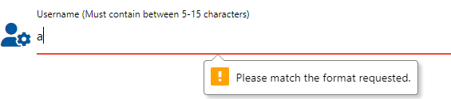

    #

    Below the Login form is a small section for users who have not yet registered and will be unable to login, with the hyperlink directing the customer to the registration page.

    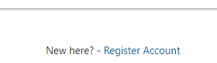

    #

    Upon attempting to login, and once validation checks have been passed, the database is accessed in the following manner:

    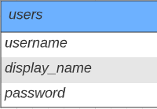

    1. The `users` collection is searched for a value matching the username entered into the form in the "username" field.
       - If this fails, the user is returned to the login page and a flash message of `Incorrect Username and/or Password` is displayed.
    2. The `check_password_hash` function from `Werkzeug` is called and is passed the value entered into the password field on the input form. This hashed value is checked against the value held in the `password` field in the `users` collection.
       - If this fails, the user is returned to the login page and a flash message of `Incorrect Username and/or Password` is displayed.
    3. Upon both of the above checks passing, the user is directed to the Profile page, with the `username` value being passed as the current session user.

    The display_name value is not used at any point in the login process, but is described in more detail in the Register and Profile sections.

    #

  - Register

    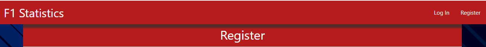

    As with the Login page, the Register page has intentionally been kept as simple as possible to direct the actions by the user without the need for any additional instructions.

    The colour of the login div was intentionally kept the same as that of the navbar, but a shadow was applied to the top of the div to provide some separation between the elements.

    #

    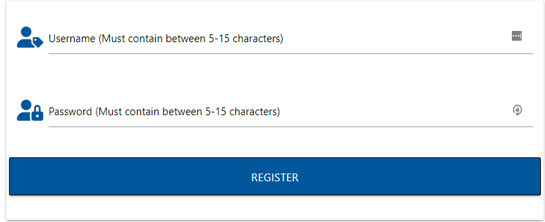

    Directly below the header of the page is the form allowing the user to login. The form contains 3 main elements - Username, Password and the Register button itself.

    Both the Username and Password fields have been given the following pattern of `^[a-zA-Z0-9]{5,15}$` which has the requirements of:

    - Only containing alphanumeric characters.
    - A minimum length of 5 characters.
    - A maximum length of 15 characters.

    Both fields are marked as required and are validated when the user clicks the 'Register' button.

    The input field for Username and Password are underlined red whilst the minimum or maximum length requirements are not met, with a tooltip being displayed to the user if they try to submit an invalid form, as shown below.

    

    #

    Below the Register form is a small section for users who have already registered and are not required to register again, with the hyperlink directing the customer to the log in. page.

    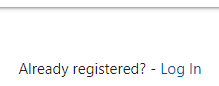

    #

    Upon attempting to register, and once validation checks have been passed, the database is accessed in the following manner:

    

    1. The `users` collection is searched for a value matching the username entered into the form in the "username" field. Unlike the login form, this check will fail if the username already existing within the database, as the same username cannot be used twice.
       - If this fails, the user is returned to the register page and a flash message of `Username already exists` is displayed.
    2. A new entry is made into the database with the following details:
       - Username is converted to lower case added to the `username` field
       - Username is added, as it was entered in the form, to the `display_name`
       - The `generate_password_hash` from `Werkzeug` is called and this value is added to the `password` field.
    3. A session cookie is created with the name `user` and the value from the `username` field on the register form.
    4. The user is directed to the Profile page, with the `username` value being passed as the current session user and a flash message is shown stating `Registration Successful!`.

  - Logout

    When the user selects the `Logout` button, the session cookie is removed with `session.pop` and the user is directed to the login page.
    A flash message is then shown to the user advising `You have been logged out.`

- ## Note For Sections Below

  A number of the sections below contain similar features as [DataTables](https://datatables.net/) was used to add functionality and, for the purpose of simplicity, I wanted to describe the features present on multiple pages to save on repetition.

  #

  All pages below require a user to be logged in. If a user is not logged in, they will automatically be redirected to the login page.

  #

  All pages share the same design features as the login and register pages and, unless specified, always show the name of the page the user is currently on.

  #

  As the dataset used contains a large amount of data, the main focus of this project was to allow easy viewing and searching and, as described above, [DataTables](https://datatables.net) was used to add pagination and search functionality, plus the ability for the user to select how many entries are displayed on the page.

  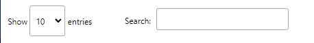

  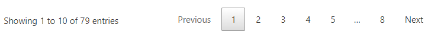

- ## Circuits

  - ### Circuit Overview

    The Circuit page itself is a table of information retrieved from the database (which is described below) and contains the following information:

    - Circuit Name
    - Location (City)
    - Country
    - A button linking to Google Maps using Latitude and Longitude
    - A button linking to the Wikipedia article about the Circuit.
    - A button linking to a more in depth view of the Circuit.

    A `for` loop is used to enter the details of each circuit into a data cell of the table, which is then styled by [DataTables](https://datatables.net).

    The manner in which each field is retrieved from the database is detailed in the image below.

    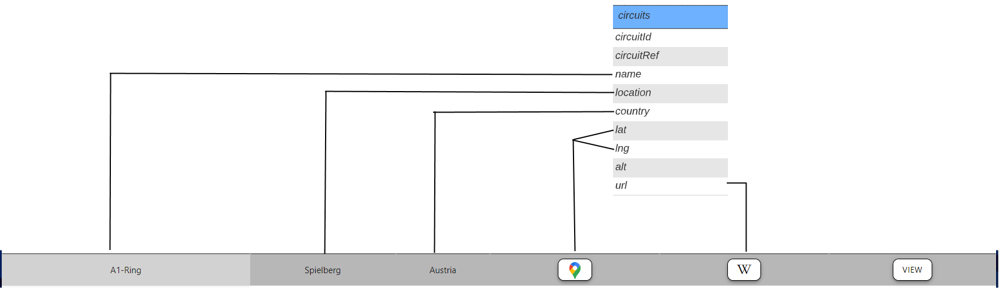

  - ### Circuit View

    Upon clicking the `View` button on the Circuits page, the user is shown a more in depth break down of information about the circuit.

    At the top of the page, either an `Add to Favourites` or `Remove From Favourites` button is displayed.

    When the page is loaded, the `Favourites` collection is checked for any entries in which the `username` and `circuitId` fields match the `_id` of the current circuit.

    More information about this can be found in the [Favourites](#favourites) section.

    The user is shown some information that matches the previous page such as the Location, Country and a link to Google Maps for the Circuit.

    Below this section is a table containing all F1 races that have been held at the circuit.

    This is achieved with a `for` loop of the `races` collection, searching for any circuits with a `circuitId` matching that of the current circuit, with all results being output to a table.

    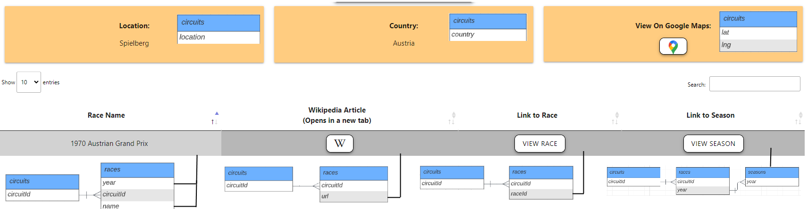

    More information about this page can be found in the [Features To Add](#features-to-add) section.

- ## Constructors

  - ### Constructor Overview

    The Constructor page itself is a table of information retrieved from the database (which is described below) and contains the following information:

    - Constructor Name
    - Constructor Nationality
    - A button linking to the Wikipedia article about the Constructor.
    - A button linking to a more in depth view of the Constructor.

    A `for` loop is used to enter the details of each Constructor into a data cell of the table, which is then styled by [DataTables](https://datatables.net).

    The manner in which each field is retrieved from the database is detailed in the image below.

    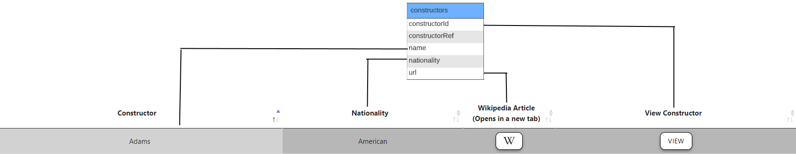

  - ### Constructor View

    Upon clicking the `View` button on the Constructor page, the user is shown a more in depth break down of information about the Constructor.

    At the top of the page, either an `Add to Favourites` or `Remove From Favourites` button is displayed.

    When the page is loaded, the `Favourites` collection is checked for any entries in which the `username` and `constructorId` fields match the `_id` of the current constructor.

    More information about this can be found in the [Favourites](#favourites) section.

    The [Wikipedia API](https://www.mediawiki.org/wiki/API:Main_page) is called using the constructor `name` as the title of the Wikipedia page. The API returns the head image of the Wikipedia article. If no image exists, the user is instead shown a 'No image available' replacement.

    The user is shown some information that matches the previous page such as the Name and Nationality of the Constructor. Additionally, there is a link to the Wikipedia article at the top of the page.

    Below this section is a table containing race statistics for the selected constructor such as the number race entries, wins, podiums and the percentage of wins the constructor has achieved.

    This is achieved with a `for` loop of the `results` collection, searching for any race entries with a `constructorId` matching that of the current constructor, with all results being output to a table.

    - The number of entries is equal to the number of results of the `for` loop.
    - The number of wins is equal to the number of results with a position of `1`
    - The number of podiums is equal to the number of results with a position of `1`, `2` or `3`.
    - The percentage of podiums is equal to the number of entries divided by the value of the number of podiums.
    - The percentage of wins is equal to the number of entries divided by the value of the number of wins.

    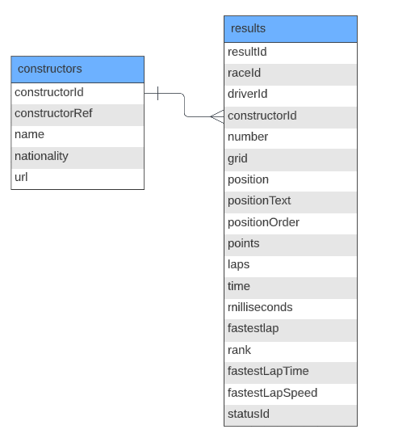
    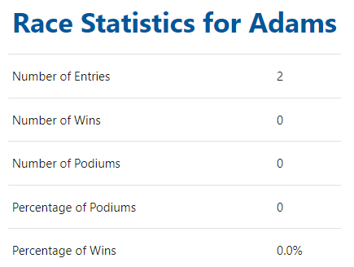

    More information about this page can be found in the [Features To Add](#features-to-add) section.

- ## Drivers

  - ### Driver Overview

    The Driver page itself is a table of information retrieved from the database (which is described below) and contains the following information:

    - Driver Forename
    - Driver Surname
    - Driver Code
    - Driver Number
    - Driver Date of Birth
    - Driver Nationality
    - A button linking to the Wikipedia article about the Driver.
    - A button linking to a more in depth view of the Driver.

    A `for` loop is used to enter the details of each Driver into a data cell of the table, which is then styled by [DataTables](https://datatables.net).

    The manner in which each field is retrieved from the database is detailed in the image below.

    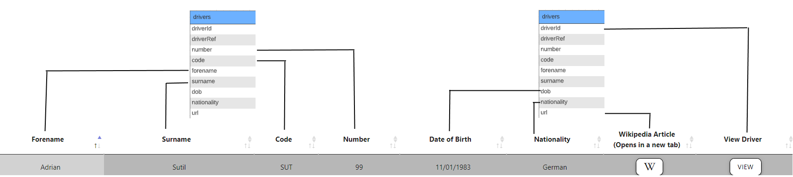

  - ### Driver View

    Upon clicking the `View` button on the Driver page, the user is shown a more in depth break down of information about the Driver.

    At the top of the page, either an `Add to Favourites` or `Remove From Favourites` button is displayed.

    When the page is loaded, the `Favourites` collection is checked for any entries in which the `username` and `driverId` fields match the `_id` of the current driver.

    More information about this can be found in the [Favourites](#favourites) section.

    The [Wikipedia API](https://www.mediawiki.org/wiki/API:Main_page) is called using the Driver `forename` and `surname` as the title of the Wikipedia page. The API returns the head image of the Wikipedia article. If no image exists, the user is instead shown a 'No image available' replacement.

    The user is shown some information that matches the previous page such as the Name, Nationality, Date of Birth and Driver Code for the Driver. Additionally, there is a link to the Wikipedia article at the top of the page.

    Below this section is a table containing race statistics for the selected driver such as the number race entries, wins, podiums and the percentage of wins the constructor has achieved.

    This is achieved with a `for` loop of the `results` collection, searching for any race entries with a `driverId` matching that of the current driver, with all results being output to a table.

    - The number of races is equal to the number of results of the `for` loop.
    - The number of wins is equal to the number of results with a position of `1`
    - The number of podiums is equal to the number of results with a position of `1`, `2` or `3`.
    - The percentage of podiums is equal to the number of races divided by the value of the number of podiums.
    - The percentage of wins is equal to the number of races divided by the value of the number of wins.

    Below the statistics is a chart built using MongoDB charts.

    The chart contains all the data from the results table, but a filter is passed to the MongoDB chart equal to the current driverID, thus only showing the required statstics.

    In early F1 races drivers had a propensity for not finishing due to vehicle unreliability. As such, if a driver did not finish any of the races they entered, no chart is shown.

    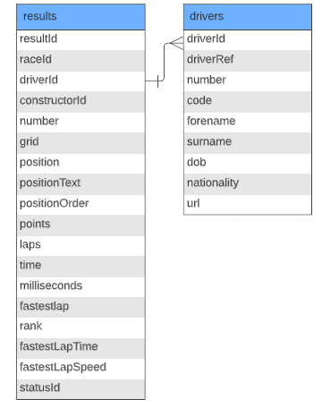
    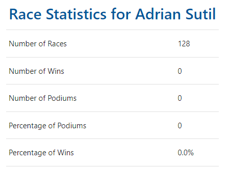
    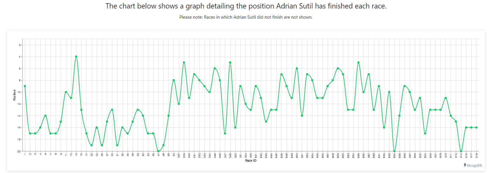

- ## Races

  - ### Race Overview

    The Race page itself is a table of information retrieved from the database (which is described below) and contains the following information:

    - Race Name
    - Race Date
    - Circuit
    - Season
    - A button linking to the Wikipedia article about the race.
    - A button linking to a more in depth view of the race.

    A `for` loop is used to enter the details of each race into a data cell of the table, which is then styled by [DataTables](https://datatables.net).

    The manner in which each field is retrieved from the database is detailed in the image below.

    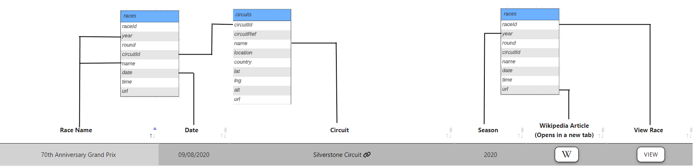

  - ### Race View

    At the top of the page, either an `Add to Favourites` or `Remove From Favourites` button is displayed.

    When the page is loaded, the `Favourites` collection is checked for any entries in which the `username` and `raceId` fields match the `_id` of the current race.

    More information about this can be found in the [Favourites](#favourites) section.

    - ### Qualifying Results

      Upon first loading, the user is shown the Qualifying Results page.

      The data is retrieved from the `qualifying` collection but, unlike other tables on the site, is not formatted using [DataTables](https://datatables.net), but is instead formatted using the styles built into [Materialize](https://materializecss.com/).

      The data is displayed based upon the current qualifying format (of 3 seperate qualifying sessions).

      For current races, this means no Q2 or Q3 data is shown for drivers finishing below 15th, and no Q3 data is shown for drivers finishing below 10th.

      For older races, data will only be displayed in the Q1 column, with all other columns left blank.

      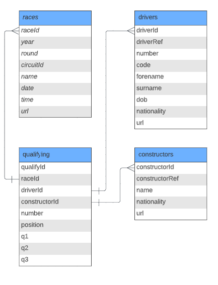
      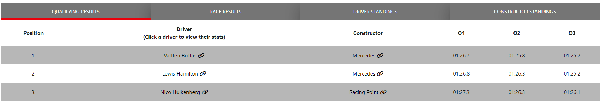

    - ### Race Results

      The second tab available to the user is the Race Results page.

      The data is retrieved from the `results` collection but, as with the qualifying results, is not formatted using [DataTables](https://datatables.net), but is instead formatted using the styles built into [Materialize](https://materializecss.com/).

      The data displayed shows the finishing order of the race with constructor, points obtained, laps completed and status at the end of the race shown, as in the example below.

      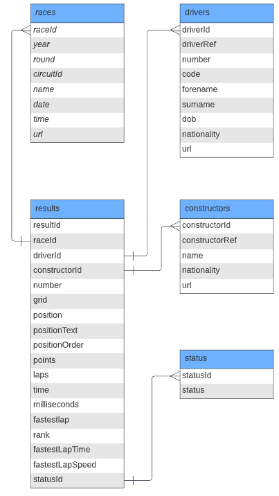
      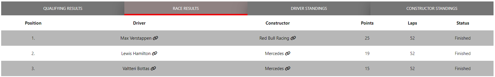

    - ### Driver Standings

      The third tab available to the user is the Driver Standings page.

      The data is retrieved from the `driver_standings` collection but, as with the qualifying and race results, is not formatted using [DataTables](https://datatables.net), but is instead formatted using the styles built into [Materialize](https://materializecss.com/).

      The data displayed shows the standings of the Drivers Championship as of the end of the race selected. The table also shows the number of wins they have achieved in the season.

      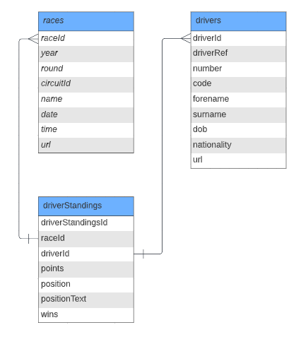
      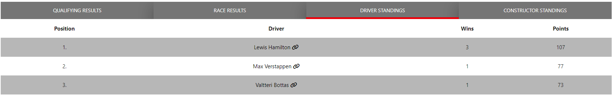

    - ### Constructor Standings

      The final tab available to the user is the Constructor Standings page.

      The data is retrieved from the `constructor_standings` collection but, as with the the previous sections, is not formatted using [DataTables](https://datatables.net), but is instead formatted using the styles built into [Materialize](https://materializecss.com/).

      The data displayed shows the standings of the Constructors Championship as of the end of the race selected. The table also shows the number of wins they have achieved in the season.

      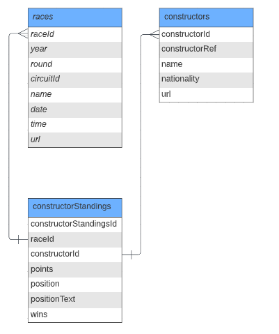
      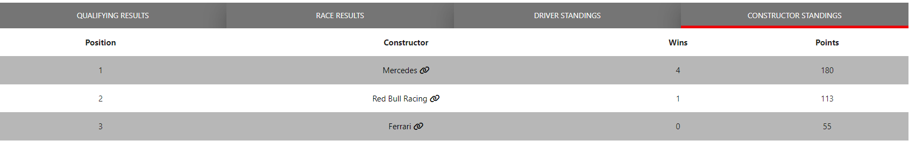

- ## Seasons

  - ### Season Overview

    The Season page itself is a table of information retrieved from the database (which is described below) and contains the following information:

    - Year
    - Number of Races in the Season.
    - A button linking to the Wikipedia article about the Season.
    - A button linking to a more in depth view of the Season.

    A `for` loop is used to enter the details of each Season into a data cell of the table, which is then styled by [DataTables](https://datatables.net).

    The manner in which each field is retrieved from the database is detailed in the image below.

    

  - ### Season View

    Upon clicking the `View` button on the Season page, the user is shown a more in depth break down of information about the Season.

    At the top of the page, the user is shown the number of races within the season.

    Below this, the winner of the Drivers Championship is shown. If this data is not held, then this section will be hidden from the user.

    Below this, the winner of the Constructors Championship is shown. If this data is not held, then this section will be hidden from the user.

    Below this section is a table containing data for each race within the selected season, such as the round number, circuit, race name, date, and time.

    This is achieved with a `for` loop of the `races` collection, searching for any race entries with a `year` matching that of the current season, with all results being output to a table.

    
    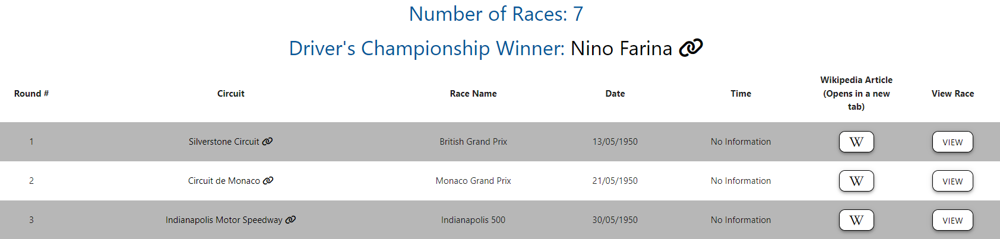

- ## Profile

  After the user has logged in, or after clicking `Profile` in the Navbar, the user will be directed to their profile.

  The URL in the address bar will show the current user's username. This means the user can type another username into the address bar if they wish, however they will always be directed back to their own profile.

  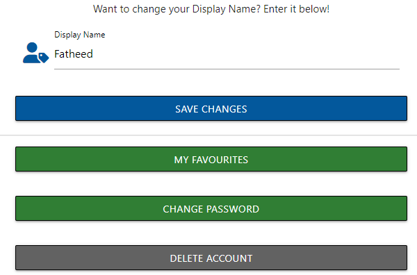

  The header of the page shows the title, which pulls the users `display_name` from the `users` collection.

  Below the title is an input field allowing the user to update their display name for the site. This allows the user to update this, if they wish, however the display name will only be shown to them and their username will remain unchanged.

  Once the user clicks the `Save Changes` button, the `display_name` field is updated in the `users` collection. The user should then be returned to their profile, but with the new display name shown in the title of the page.

  - ### Favourites

    Below the `Save Changes` button on the users profile is the `Favourites` button.

    The page is split into four sections:

    1. Circuits
    2. Constructors
    3. Drivers
    4. Races

    #

    Each section of the page contains a `for` loop which searches the `favourites` collection for any entries in which the `username` matches the current `session["user]` value.

    Entries into the database are only made with the relevant ID attached to them. For example, a circuit added to the favourites will contain the username and circuit ID, but **NOT** a Constructor, Driver or Race ID.

    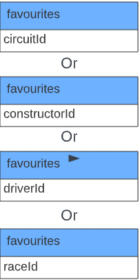

    Once these entries have been retrievied any values are shown in:

    1. Circuits if the entry contains a circuitId
    2. Constructors if the entry contains a ConstructorId
    3. Drivers if the entry contains a driverId
    4. Races if the entry contains a raceId.

    #

    An assumption is made that a user has some knowledge of the content they have added to their favourites and, as such, less data is shown on the favourites page, but the user has a direct link to the more in-depth view for each entry.

    The images below show an example of this, including the relevant information that is obtained from the database.

    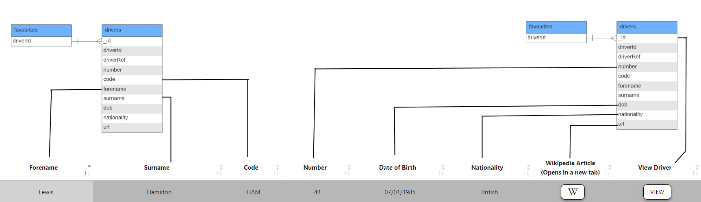

    #

  - ### Change Password

    The user has the option to update their password from the profile page, if they wish to.

    Once the `Change Password` button has been clicked, the user is directed to the `Change Password` page.

    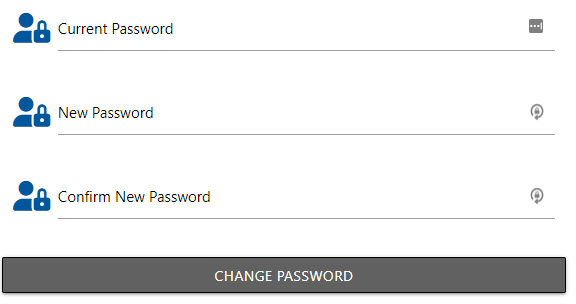

    As with other pages, the title of the page is within the template itself and reports the current page the user is on.

    The `Change Password` form can be broken down into several important parts.

    #

    - As with the login & register pages, all input fields on this page have a pattern requirement of `^[a-zA-Z0-9]{5,15}$`, indicating between 5 - 15 alphanumeric characters are required.

    - All input fields on this page require validation and this is handled in 2 seperate ways.

      - The `Current Password` field is only required to meet the minimum and maximum character requirments to pass the validation check.
      - The `New Password` and `Confirm New Password` are also required to meet the minimum and maximum character requirements, but also uses `this.setCustomValidity(this.validity.patternMismatch ?` to confirm if the previous requirements are met and if both the `New Password` and `Confirm New Password` fields have matching values.
        - If the password do not match, a tooltip is shown to the user advising `Passwords do not match`.

    #

    Once the above validation checks have passed, the next step is for the value of the `Current Password` input field to be passed to the `check_password_hash` from `Werkzeug`. This is then checked against the value held in the `users` collection, under the `password` field.

    - If this check fails, the user is returned to the change password page, and a flash message is displayed stating `Incorrect Password`.

    Following this, the `generate_password_hash` is passed the value from the `New Password` input field, which then updates the value in the `users` collection, under the `password` field.

    The user is then returned to the profile page and a flash message is displayed stating `Password has been updated successfully`.

    #

  - ### Delete Account

    The final option available to users on their profile page is to delete their account entirely and is accessed by clicking the `Delete Account` button.

    The user is presented with a large warning advising that deleting an account is an action that cannot be reversed.

    The user is required to check a checkbox which advises `I understand this action will delete my account and is not reversable`.

    The user is then required to type their username in the input field before clicking the `Delete Account` button.

    The first validation step taken after this is to ensure the checkbox has a value of `checked`.

    The value of the `username` input field is then checked against the `username` value in `session["user"]`.

    - If this check fails, the user is returned to the delete account page and a flash message is displayed stating `Username does not match`. This prevents users from deleting the accounts of others.

    Once all other checks have passed, the following actions are taken:

    - The entry in the `users` collection is deleted where `username` matches the username obtained from `session["user"]`.
    - The cookie session is deleted using `session.pop("user)`
    - The user is returned to the login page.

  #

- ## Admin Dashboard and Admin Edit

  The `Admin Dashboard` contains several options for adding entries to the database, which are described below.

  When a user attempts to access the page, the value of `session["user"]` is checked. If the `username` value is **NOT** equal to `admin` the user is redirected to the home page. Otherwise, the `Admin Dashboard` is displayed.

  All pages below also share this feature, which prevents other users from circumventing the admin dashboard page.

  - ### Add Circuit

    The `Add Circuit` page adds a new circuit entry into the `circuits` collection.

    The `Circuit ID` field is automatically populated when the page is loaded. This is achieved by accessing the `circuits` collection and ordering entries in descending order by `circuitID`, and selecting the first entry.

        mongo.db.circuits.find_one(sort=[("circuitId", -1)])

    The value is then incremented by 1, ensuring that any future circuits added have a sequential `circuitId`.

    The `Circuit Ref`, `Circuit Name`, `Location` and `Country` input fields are required, but do not possess any other requirements such as a minimum or maximum length.

    Both the `Latitude` and `Longitude` input fields have a pattern of `^[0-9\.]*$` ensuring only numerical values or a full-stop/period can be entered. When the form is submit, both these values are stored in the database as `floats` rather than `integers`.

    The input field for the `Wikipedia Link` has neither a required tag, or a minimum or maximum length requirement. This is due to entries potentially being created before the relevant Wikipedia articles exist.

    The `Cancel` button returns the admin user back to the `Admin Dashboard`

    Upon clicking the `Submit Changes`, the form is validated ensuring all required input fields have been completed.

    The data is then applied to the database in the following manner:

    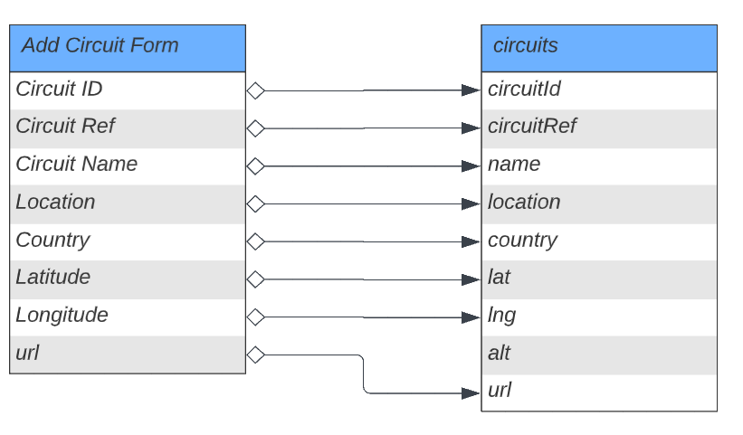

    #

  - ### Add Constructor

    The `Add Constructor` page adds a new circuit entry into the `constructors` collection.

    The `Constructor ID` field is automatically populated when the page is loaded. This is achieved by accessing the `constructors` collection and ordering entries in descending order by `constructorId`, and selecting the first entry.

        mongo.db.constructors.find_one(sort=[("constructorId", -1)])

    The value is then incremented by 1, ensuring that any future constructors added have a sequential `constructorId`.

    The `Constructor Ref` and `Constructor Name` input fields are required, but do not possess any other requirements such as a minimum or maximum length.

    It is required to select a nationality for the constructor to be added to the database successfully. This is achieved with a `for` loop over the `countries` collection.

    This collection was created manually using the data from the [Flag Icons](https://github.com/lipis/flag-icons) repository created by [Lipis](https://github.com/lipis).

    The select field also takes advantage of the ability to include an image with each option. Within the `for` loop, the name of the country and its 2 letter code is returned, which corresponds to an SVG image of the flag.

    The input field for the `Wikipedia Link` has neither a required tag, or a minimum or maximum length requirement. This is due to entries potentially being created before the relevant Wikipedia articles exist.

    The `Cancel` button returns the admin user back to the `Admin Dashboard`

    Upon clicking the `Submit Changes`, the form is validated ensuring all required input fields have been completed.

    The data is then applied to the database in the following manner:

    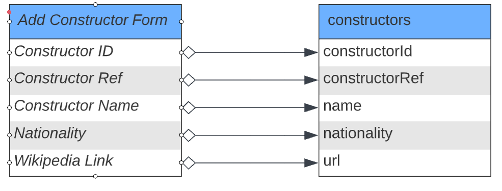

    #

  - ### Add Driver

    The `Add Driver` page adds a new circuit entry into the `drivers` collection.

    Once again, the `Driver ID` field is automatically populated when the page is loaded. This is achieved by accessing the `drivers` collection and ordering entries in descending order by `driverId`, and selecting the first entry.

        mongo.db.drivers.find_one(sort=[("driverId", -1)])

    The value is then incremented by 1, ensuring that any future constructors added have a sequential `driverId`.

    The `Forename`, `Surname` and `Driver Ref` input fields are required, but do not possess any other requirements such as a minimum or maximum length.

    The `Number` and `Code` input fields are not required, but do have pattern requirements if information is to be entered.

    The `Number` field will accept upto 2 numeric characters, enforced with the pattern `^[0-9\]{2}$`, whilst the `Code` field will only accept letter which is enforced with the pattern `^[a-zA-Z]{3}$`.

    It is required to select a nationality for the driver to be added to the database successfully. This is achieved with a `for` loop over the `countries` collection.

    This collection was created manually using the data from the [Flag Icons](https://github.com/lipis/flag-icons) repository created by [Lipis](https://github.com/lipis).

    The select field also takes advantage of the ability to include an image with each option. Within the `for` loop, the name of the country and its 2 letter code is returned, which corresponds to an SVG image of the flag.

    The `Date of Birth` field uses the Date Picker provided with [Materialize](https://materializecss.com/) and is formatted to match the UK style of date recording with `format: "dd/mm/yyyy"`.

    The input field for the `Wikipedia Link` has neither a required tag, or a minimum or maximum length requirement. This is due to entries potentially being created before the relevant Wikipedia articles exist.

    The `Cancel` button returns the admin user back to the `Admin Dashboard`

    Upon clicking the `Submit Changes`, the form is validated ensuring all required input fields have been completed.

    The data is then applied to the database in the following manner:

    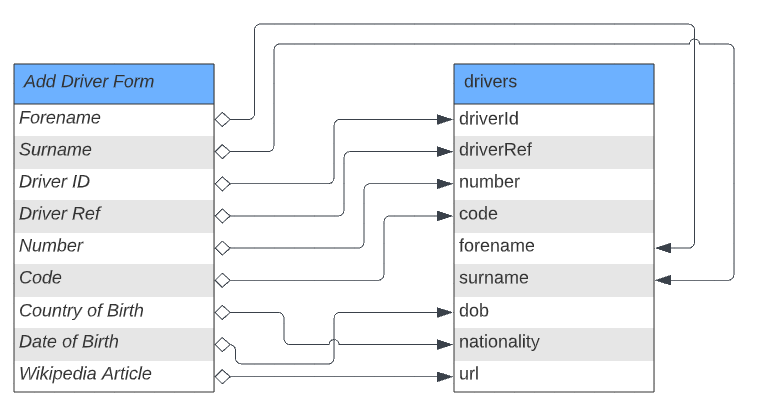

    #

  - ### Add Race

    The `Add Race` page adds a new circuit entry into the `races` collection.

    Once again, the `Race ID` field is automatically populated when the page is loaded. This is achieved by accessing the `races` collection and ordering entries in descending order by `raceID`, and selecting the first entry.

        mongo.db.races.find_one(sort=[("raceId", -1)])

    The value is then incremented by 1, ensuring that any future constructors added have a sequential `raceId`.

    All but the `Wikipedia Link` input fields are required when adding a race, and the data is obtained as detailed below.

    The `Year` input field will only accept numbers and exactly 4 numbers must be entered for the input field to be valid. This is achieved with a pattern of `^[0-9]{4}$`.

    The `Round` input field will accept between 1 and 2 numbers, as round number traditionally start counting up from 1. This was done as the current record for the number of races in a season is 23. It is unlikely that this will exceed the 2 number limit any time soon. This is achieved with a pattern of `^[0-9]{1,2}$`.

    The `Date of Birth` field uses the Date Picker provided with [Materialize](https://materializecss.com/) and is formatted to match the UK style of date recording with `format: "dd/mm/yyyy"`.

    The `Time` field uses the Time Picker provided with [Materialize](https://materializecss.com/). By default the time picker outputs time in a 12-hour format. This has been disabled with `twelveHour: false` in `script.js`. As the existing data in the dataset contains entries with the format of `HH:MM:SS`, the output is amended using the jQuery code below.

        $(".timepicker").on("change", function () {
        let receivedVal = $(this).val();
        $(this).val(receivedVal + ":00");
        });

    The `Race Name` field is still required to be completed, but does not have any minimum or maximum requirements, but it is expected that the correctly formatted name is entered. Due to the variety of names, applying any sort of restriction is likely to cause more problems than it will solve.

    As entries in the `races` collection contain the Circuit ID, I needed to find a way for the user to obtain this without having to search or memorise any information.

    I achieved this by using the modal built into [Materialize](https://materializecss.com/). The modal is loaded and populated with data from the `circuits` collection, with only the circuit name and circuit ID shown, with a "Select" button allowing the user to pick a circuit.

    

    Above the list of circuits is a search box, again provided as part of [Materialize](https://materializecss.com/), allowing the user to filter the list of circuits, speeding up completion of the form.

    The input field for the `Wikipedia Link` has neither a required tag, or a minimum or maximum length requirement. This is due to entries potentially being created before the relevant Wikipedia articles exist.

    The `Cancel` button returns the admin user back to the `Admin Dashboard`

    Upon clicking the `Submit Changes`, the form is validated ensuring all required input fields have been completed.

    The data is then applied to the database in the following manner:

    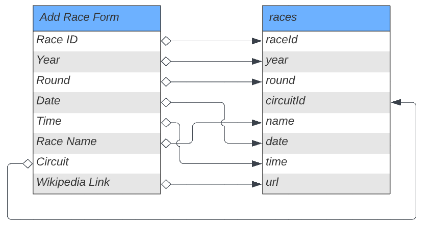

    #

  - ### Add Season

    The `Add Season` page adds a new circuit entry into the `seasons` collection.

    Unlike the other options to add content, the `seasons` collection does not contain a `seasonId`, instead using `year` to identify each season.

    The `Year` input field will only accept numbers and exactly 4 numbers must be entered for the input field to be valid. This is achieved with a pattern of `^[0-9]{4}$`.

    The `Number of Races` input field will accept between 1 and 2 numbers, as round number traditionally start counting up from 1. This was done as the current record for the number of races in a season is 23. It is unlikely that this will exceed the 2 number limit any time soon. This is achieved with a pattern of `^[0-9]{1,2}$`.

    I have added 2 fields to the `seasons` database of `driversChampionId` and `constructorChampionId`, with data being manually entered to populate the database with the relevant information.

    As with the `Add Race` page, a modal has been employed to aid in the selection of the Drivers Champion and Constructors Champion.

    I achieved this by using the modal built into [Materialize](https://materializecss.com/). The modal is loaded and populated with data from the `drivers` or `constructors` collection, with only the name and relevant ID shown, with a "Select" button allowing the user to pick a driver or constructor required..

    Above the list is a search box, again provided as part of [Materialize](https://materializecss.com/), allowing the user to filter the list, speeding up completion of the form.

    The input field for the `Wikipedia Link` has neither a required tag, or a minimum or maximum length requirement. This is due to entries potentially being created before the relevant Wikipedia articles exist.

    The `Cancel` button returns the admin user back to the `Admin Dashboard`

    Upon clicking the `Submit Changes`, the form is validated ensuring all required input fields have been completed.

    The data is then applied to the database in the following manner:

    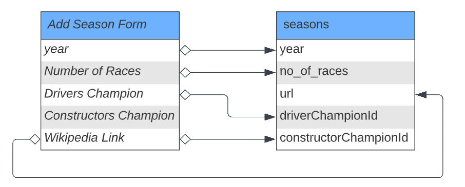

    #

  - ### Edit Driver

    When logged in as the `admin` user and viewing the `Drivers` page, an additional button is shown to allow the details of a driver to be edited.

    The data is obtained from the same fields it is entered into on the `Add Driver` page and populates the form.

    

    The same requirements are present as on the `Add Driver` page ([View 'Add Driver' for more information](#add-driver)).

    Once the required alterations are made and the form submitted, assuming all validation checks have been passed, the data is then `updated` in the database, rather than an entirely new entry being created as happens on the `Add Driver` page.

    #

  - ### Edit Race

    The `Edit Race` page has **2** main functions split across **4** different sections.

    The **2** functions depend upon if any data exists in the databse.

    This is important as the admin user may edit existing races (eg. Races that have already happened), but also races for the current season that have not happened yet.

    As the overall goal of the page is the same (to add or update the database), I will explain each of the **4** sections, and go into detail about the different ways in which data is submitted at the end.

    A common theme between all of the sections is the user of the `Select Driver` and `Select Constructor` modals which work in a the same way as those used in the [Add Race](#add-race) and [Add Season](#add-season) pages.

    As such, I will not explain the details of these modals again, to save repition.

    The length of the pages is dictated by the current number of drivers in the F1 championship, 20.

    - Edit Qualifying

      The qualifying data requires the name of the driver, their constructor and the appropriate qualifying times be provided. The first two pieces of information are provided using the aformentioned `Select Driver` and `Select Constructor` modals.

      The resulting qualifying times are to be entered manually depending upon the drivers final finishing position.

      - Drivers who qualify in the top 10 require times for Q1, Q2 & Q3.
      - Drivers who qualify between 11-15 require times for Q1 & Q2.
      - Drivers who qualify 16-20 require times for Q1 only.

      All Q1, Q2 and Q3 fields have the following pattern applied to them:

      `^([0-9]{2}:[0-5][0-9].[0-9]{1,3})$`

      The qualifying times are broken down into minutes, seconds and milliseconds.

      - Minutes - Requires 2 numerical characters.
      - Seconds - Requires 2 numerical characters. The first can be between 0-5, and the second between 0-9.
      - Milliseconds - Requires between 1 and 3 numerical characters. Existing data only has data to the first decimal place, but this gives the user the option to add values upto the 3 decimal place.

      The times are seperated by a colon and a full-stop/period respectively.

      The resulting time should be provided as `MM:SS.SSS`

      The `Submit Changes` button at the bottom of the page is generated depending on if data exists in the database on page load.

      - If no data exists, the button is given a value of `qualifying` and [this code](https://github.com/Fatheed7/formula-one-stats/blob/main/app.py#L144-L158) is executed, with new data being inserted into the database.
      - If data already exists, the button is given a value of `qualifying-update` and [this code](https://github.com/Fatheed7/formula-one-stats/blob/main/app.py#L160-L176) is executed, with the existing code being replaced in the database.

      #

    - Edit Race

      The race data requires the position, position text, driver forename & surname, constructor, points, laps and status.

      The `Driver Forename`, `Driver Surname`, `Constructor` and `Status` are all populated in the same manner as described previously, and as mentioned at the top of this section.

      The position value is read only, and is populated either from the value held in `position` within the `results` collection, or by using `for n in range(20)`.

      The position text value is to be populated by the user and must fall into one of the following values:

      - Position number if the driver finished the race.
      - D - Disqualified
      - E - Excluded
      - F - Failed to qualify
      - N - Not Classified
      - R - Retired
      - W - Did Not Start - Withdrew

      A tooltip for each letter is provided in the table head for this column.

      Both the `Points` and `Laps` fields are to be completed by the user dependent upon the finishing position of each driver. Some consideration was given to automatically generating the points information, but this does not account for changes in the scoring system or for the additional point from a fastest lap.

      Both fields have the pattern of `^[0-9]{1,2}$` requiring 1-2 numerical characters.

      The `Submit Changes` button at the bottom of the page is generated depending on if data exists in the database on page load.

      - If no data exists, the button is given a value of `race` and [this code](https://github.com/Fatheed7/formula-one-stats/blob/main/app.py#L178-L199) is executed, with new data being inserted into the database.
      - If data already exists, the button is given a value of `race-update` and [this code](https://github.com/Fatheed7/formula-one-stats/blob/main/app.py#L201-L225) is executed, with the existing code being replaced in the database.

      #

    - Edit Driver Standings

      The Driver Standings data requires the position, driver name, number of wins and points be entered.

      The `Driver Name` is populated in the same manner as described previously, and as mentioned at the top of this section.

      The position value is read only, and is populated either from the value held in `position` within the `driver_standings` collection, or by using `for n in range(20)`.

      The `Wins` and `Points` fields are to be completed manually and are representative of the standings at the end of the given race.

      Both fields have the pattern of `^[0-9]{1,2}$` requiring 1-2 numerical characters.

      The `Submit Changes` button at the bottom of the page is generated depending on if data exists in the database on page load.

      - If no data exists, the button is given a value of `driver` and [this code](https://github.com/Fatheed7/formula-one-stats/blob/main/app.py#L227-L241) is executed, with new data being inserted into the database.
      - If data already exists, the button is given a value of `driver-update` and [this code](https://github.com/Fatheed7/formula-one-stats/blob/main/app.py#L243-L259) is executed, with the existing code being replaced in the database.

      #

    - Edit Constructor Standings

      The Constructor Standings data requires the position, driver name, number of wins and points be entered.

      The `Constructor` field is populated in the same manner as described previously, and as mentioned at the top of this section.

      The position value is read only, and is populated either from the value held in `position` within the `constructor_standings` collection, or by using `for n in range(20)`.

      The `Wins` and `Points` fields are to be completed manually and are representative of the standings at the end of the given race.

      Both fields have the pattern of `^[0-9]{1,2}$` requiring 1-2 numerical characters.

      The `Submit Changes` button at the bottom of the page is generated depending on if data exists in the database on page load.

      - If no data exists, the button is given a value of `constructor` and [this code](https://github.com/Fatheed7/formula-one-stats/blob/main/app.py#L261-L276) is executed, with new data being inserted into the database.
      - If data already exists, the button is given a value of `constructor-update` and [this code](https://github.com/Fatheed7/formula-one-stats/blob/main/app.py#L278-L295) is executed, with the existing code being replaced in the database.

    #

  - ### Manage Users

    The `Manage Users` page allows the admin user to view a list of currently registered users and their chosen display names.

    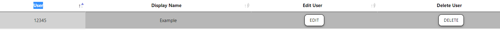

    Although the display name is only available to the user logged into that account, this is something that could potentially change in the future and it is therefore important for the `admin` user to have an oversight of the users to prevent unsuitable or offensive usernames or display names being used.

    To this end, the `admin` user has two options available:

    - Edit User

      This gives the `admin` user the option to update the display name value in use and is useful for the reasons mentioned above. It is important that the username never be changed as this can cause issues when the user next attempts to sign in.

      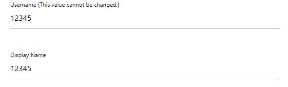

      Once this form is submitted, assuming it meets the same 5-15 character requirements for all usernames, the `display_name` field is updated in the `users` collection. The `admin` user is returned to the `Manage Users` page and a flash message is shown stating `Display Name has been updated successfully.`.

    - Delete User

      Expanding upon the previous action, sometimes an `admin` user may want to remove a user entirely if certain rules have been broken or a username is offensive.

      When selecting `Delete`, the `admin` user is taken to a similar warning page as if a user were to delete their own account, as shown below.

      Most importantly, the `admin` user is excluded from this list and, as such, is unable to delete their own account.

      

      Once this form is submitted, the user is deleted using `delete_one`, however as the `admin` user can delete any account, there are no checks against the `session["user"]` value, as this is not needed.

- ## 404 Page

- ## Footer

#

## Features to Add

#

## Deployment

This project was created using GitHub and hosted on the Heroku Platform.

The following steps were taken to deploy the project:

    1. Login to the Heroku website, or create an account if you don't already have one.
    2. After you have logged in, click on 'New' in the top right of the screen and select 'Create New App'
    3. Enter a name for your app(This name MUST be unique). Heroku will display a warning if your chosen name has already been taken.
    4. Choose the region in which you would like your app to be hosted.
    5. Go to the Settings tab and go to "Config Vars", and then select "Reveal Config Vars"
    6. Enter PORT into the KEY field and 8000 into the value, then click "Add".
    7. Add any other relevant Config Vars to this section by repeating Step 6.
    8. Navigate to the "Deploy" tab, and select Github as the deployment method
    9. Log in to Github and select the repository you wish to link with Heroku.
    10. You can choose between two deployment options for your app.
      - Automatic will re-deploy your app when changes are made to the linked repository, or you will be notified if the deployment has failed.
      - Manual deployment requires you to log in to Heroku and select the "Deploy" button when any changes have been made.
    11. Once these steps have been followed your app will be built and deployed.
      - If successful you will be provided a link to the live page.
      - If not successful, the build will fail and the activity log will provide more information about the issue.

#

## Testing

- ## Manual Testing

  

    
CSS Validation

  CSS was validated using [The W3C CSS Validation Service](https://jigsaw.w3.org/css-validator/validator). A full report can be viewed [here](docs/readme_images/CSS_Validation/css_validator_full.png).

  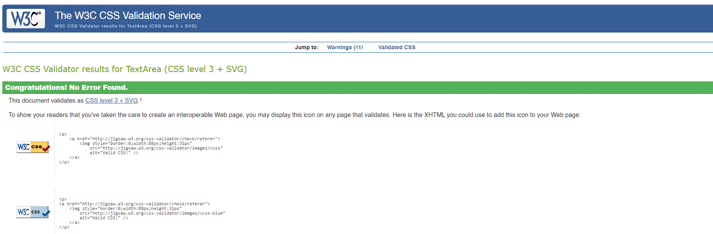

  

  

    
HTML Validation

  HTML was validated using [The W3C Nu Html Checker](https://validator.w3.org/nu/). All pages were checked using this tool and most screens have been captured and can be viewed [here](docs/readme_images/HTML_Validation/). Some pages have not been captured due to the large number of lines contained on certain pages.

  

  

    

  

    
JS / Jquery Validation

  Javascript/JQuery was validated using [JSHint](https://jshint.com/). Three warnings were returned, but all contained the same information regarding the use of 'let'. As ES6 is the version being used, these warnings were disregarded.

  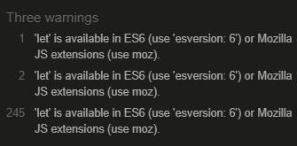

  

#

- ## Lighthouse Testing

#

- ## Wave Testing

  All pages on the site were tested using the [WAVE Web Accessibility Evaluation Tool](https://wave.webaim.org/). All pages returned **0 errors**, **0 contrast errors**. A single Alert was returned on the Login page advising of a redundant link, but I believe this is not valid.

  Due to the number of pages contained on the site, I have not linked the images within this repository, but the site can be explored on the WAVE tool by clicking [this link](https://wave.webaim.org/report#/https://formula-one-statistics.herokuapp.com/).

  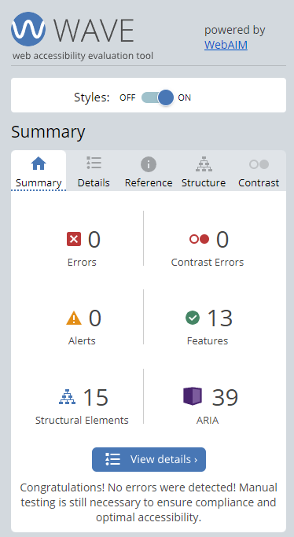

#

## Credits

- ## Languages and Frameworks

  - [HTML5](https://en.wikipedia.org/wiki/HTML5)
  - [CSS](https://en.wikipedia.org/wiki/CSS)
  - [Flask](https://flask.palletsprojects.com/en/2.1.x/)
  - [Javascript](https://en.wikipedia.org/wiki/JavaScript)
  - [Jinja2](https://jinja.palletsprojects.com/en/3.1.x/)
  - [JQuery](https://en.wikipedia.org/wiki/JQuery)
  - [Materialize](https://materializecss.com/)
  - [Python](<https://en.wikipedia.org/wiki/Python_(programming_language)>)

- ## Libraries and Tools

  - [Am I Responsive](http://ami.responsivedesign.is/) - Used to verify responsiveness of website on different devices.
  - [Balsamiq](https://balsamiq.com/) - Used to generate Wireframe images.
  - [Browser Stack](https://www.browserstack.com/) - Used for Cross Site Browser Testing.
  - [Chrome Dev Tools](https://developer.chrome.com/docs/devtools/) - Used for overall development and tweaking, including testing responsiveness and performance.
  - [DataTables](https://datatables.net/) - A JQuery tool to allow pagination and searching functionality to be added to tables easily.
  - [Favicon.io](https://favicon.io) - Used to generate Favicon image.
  - [Font Awesome](https://fontawesome.com/) - Used for icons on multiple pages.
  - [Flag Icons](https://github.com/lipis/flag-icons) - Repo created by [Lipis](https://github.com/lipis) containing SVG images of all country flags.
  - [GitHub](https://github.com/) - Used for version control.
  - [Heroku](https://heroku.com) - Used for deployment and hosting of the project.
  - [JQuery](https://en.wikipedia.org/wiki/JQuery) - Used to simplify definition of DOM elements, but used minimally with a preference for vanilla Javascript.
  - [JSHint](https://jshint.com/about/) - Linter used to flag errors, bugs and warnings.
  - [Kaggle User Rohanrao](https://www.kaggle.com/datasets/rohanrao/formula-1-world-championship-1950-2020) - The dataset used for this project was uploaded to Kaggle by the user Rohanrao.
  - [LucidChart](https://lucid.app/) - Used to create the flowchart for this site.
  - [PEP8Online](http://pep8online.com/) - Tool used to ensure app.py is PEP8 compliant.
  - [Prettier](https://marketplace.visualstudio.com/items?itemName=esbenp.prettier-vscode) - Used for consistent code formatting.
  - [Slack](https://slack.com/) - Used for support and advice from the Code Insitute Community.
  - [SVG Backgrounds](https://www.svgbackgrounds.com/) - Used to style the background for the site due to low file size and responsiveness. Licensed under [CC-BY 4.0](https://creativecommons.org/licenses/by/4.0/).
  - [Visual Studio Code](https://code.visualstudio.com/) - Application used for development of this site.
  - [W3C](https://www.w3.org/) - Used for HTML & CSS Validation.
  - [WAVE](https://wave.webaim.org/) - Used for Accessibility evaluation.
  - [Wikipedia API](https://www.mediawiki.org/wiki/API:Main_page) - This API was used to obtain images of drivers and constructors directly from the relevant Wikipedia page.

- ## Images

  The emoji graphic used for the favicon is from the open source project [Twemoji](https://twemoji.twitter.com/). The graphics are copyright 2020 Twitter, Inc and other contributors. The graphics are licensed under [CC-BY 4.0](https://creativecommons.org/licenses/by/4.0/).

  The [404 - Page Not Found](static/img/404.jpg) image was created by, and used with permission from, Reddit user [heyitsalex85](https://www.reddit.com/user/heyitsalex85/).
