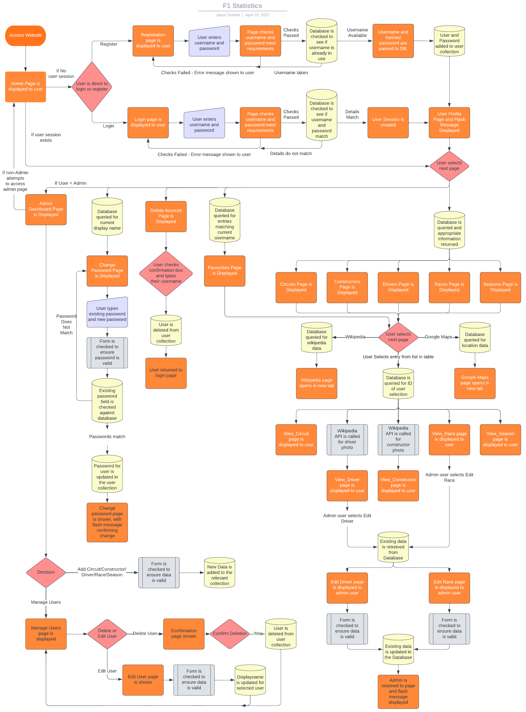

# F1 Statistics - CI Project 3

This website was created as a third portfolio project for Code Institute's Diploma in Web Application Development. The site was inspired by my interest in FORMULA 1 as a sport and a desire to have easily accesible information.

The website can be [found here](https://formula-one-statistics.herokuapp.com/).

## Table of Contents

- [Objective](#objective)
- [UX and UI](#ux-and-ui)
  - [Site Owner Goals](#site-owner-goals)
  - [User Stories](#user-stories)
  - [Wireframes](#wireframes)
- [Design](#design)
  - [Background](#background)
  - [Colours](#colours)
  - [Fonts](#fonts)
  - [Favicon](#favicon)
- [Logic](#logic)
  - [Flowchart](#flowchart)
- [Features](#features)
  - [Home Page](#home-page)
  - [Circuits](#circuits)
  - [Constructors](#constructors)
  - [Drivers](#drivers)
  - [Races](#races)
  - [Seasons](#seasons)
  - [Profile](#profile)
    - [Favourites](#favourites)
    - [Change Password](#change-password)
    - [Delete Account](#delete-account)
  - [Admin Dashboard](#admin-dashboard)
  - [404 Page](#404-page)
- [Deployment](#deployment)
- [Testing](#testing)
  - [Validator Testing](#validator-testing)
  - [Manual Testing](#validator-testing)
- [Credits](#credits)
  - [Languages](#languages)
  - [Frameworks, Libraries and Tools](#frameworks-libraries-and-tools)
  - [Images](#images)

## Objective

#

## UX and UI

- ### Site Owner Goals

  The goal of the site for the owner is to:

  1.
  2.
  3.

#

- ### User Stories

  - #### First Time Visitor Goals

    1.
    2.
    3.

  - #### Returning Visitor Goals

    1.
    2.

  #

  ## Wireframes

  The wireframes for this site were created using Balasmiq, with each section and subsection noted.

  The directory containing the wireframe images can be found [here]().

#

## Logic

- ## Flowchart

     

    
Show Flowchart

  
    

I spent time thinking about the logic and flow of the site to make sure I had a rough idea of how things were to be laid out and how each part of the site would interact with the database. The flowchart was created using [Lucidchart](https://lucid.app/).

## Design

- ## Background

  I made use of the tool available at [SVG Backgrounds](https://www.svgbackgrounds.com/) for this site for a number of reasons.

  - Due to the background being a scalable vector graphic, it will not lose sharpness or quality as the screen size increases and will remain responsive.
  - Due to being an SVG, the file size of the entire background is around 5kb, greatly reducing the total size of the assets required on page load.
  - The tool offers a large amount of customisation and is free for use, as long as attribution is given.
  - The colour of the background chosen has high contrast against the predominantly grey colour scheme of the main game.

- ## Colours

  -  - This colour was chosen for the navbar and footer as a subtle nod to the main colour of the official FORMULA 1 logo.
  -  - This colour is used for the icons on the main page and was chosen as it contrasts well against the striking red colour of the navbar.
  - 
  - 
  - 
  - 

#

- ## Fonts

- ## Favicon

# Features

- ## Home Page

- ## Circuits

- ## Constructors

- ## Drivers

- ## Races

- ## Seasons

- ## Profile

  - ### Favourites
  - ### Change Password
  - ### Delete Account

- ## Admin Dashboard

- ## 404 Page

#

## Deployment

#

## Testing

- ## Manual Testing

 

  
CSS Validation

CSS was validated using [The W3C CSS Validation Service](https://jigsaw.w3.org/css-validator/validator). A full report can be viewed [here](docs/readme_images/css_validator_full.png).

  

#

- ## Lighthouse Testing

#

- ## Wave Testing

#

## Credits

- ## Languages and Frameworks

  - [HTML5](https://en.wikipedia.org/wiki/HTML5)
  - [CSS](https://en.wikipedia.org/wiki/CSS)
  - [Flask](https://flask.palletsprojects.com/en/2.1.x/)
  - [Javascript](https://en.wikipedia.org/wiki/JavaScript)
  - [Jinja2](https://jinja.palletsprojects.com/en/3.1.x/)
  - [JQuery](https://en.wikipedia.org/wiki/JQuery)
  - [Materialize](https://materializecss.com/)
  - [Python](<https://en.wikipedia.org/wiki/Python_(programming_language)>)

- ## Libraries and Tools

  - [Am I Responsive](http://ami.responsivedesign.is/) - Used to verify responsiveness of website on different devices.
  - [Balsamiq](https://balsamiq.com/) - Used to generate Wireframe images.
  - [Browser Stack](https://www.browserstack.com/) - Used for Cross Site Browser Testing.
  - [Chrome Dev Tools](https://developer.chrome.com/docs/devtools/) - Used for overall development and tweaking, including testing responsiveness and performance.
  - [Favicon.io](https://favicon.io) - Used to generate Favicon image.
  - [Font Awesome](https://fontawesome.com/) - Used for icons on floating buttons.
  - [Flag Icons](https://github.com/lipis/flag-icons) - Repo created by [Lipis](https://github.com/lipis) containing SVG images of all country flags.
  - [GitHub](https://github.com/) - Used for version control and hosting.
  - [JQuery](https://en.wikipedia.org/wiki/JQuery) - Used to simplify definition of DOM elements, but used minimally with a preference for vanilla Javascript.
  - [JSHint](https://jshint.com/about/) - Linter used to flag errors, bugs and warnings.
  - [LucidChart](https://lucid.app/) - Used to create the flowchart for this site.
  - [PEP8Online](http://pep8online.com/) - Tool used to ensure app.py is PEP8 compliant.
  - [Prettier](https://marketplace.visualstudio.com/items?itemName=esbenp.prettier-vscode) - Used for consistent code formatting.
  - [Slack](https://slack.com/) - Used for support and advice from the Code Insitute Community.
  - [SVG Backgrounds](https://www.svgbackgrounds.com/) - Used to style the background for the site due to low file size and responsiveness. Licensed under [CC-BY 4.0](https://creativecommons.org/licenses/by/4.0/).
  - [Visual Studio Code](https://code.visualstudio.com/) - Application used for development of this site.
  - [W3C](https://www.w3.org/) - Used for HTML & CSS Validation.
  - [WAVE](https://wave.webaim.org/) - Used for Accessibility evaluation.
  - [Wikipedia API](https://www.mediawiki.org/wiki/API:Main_page) - This API was used to obtain images of drivers and constructors directly from the relevant Wikipedia page.

- ## Images

  The emoji graphic used for the favicon is from the open source project [Twemoji](https://twemoji.twitter.com/). The graphics are copyright 2020 Twitter, Inc and other contributors. The graphics are licensed under [CC-BY 4.0](https://creativecommons.org/licenses/by/4.0/).

  The [404 - Page Not Found](static/img/404.jpg) image was created by, and used with permission from, Reddit user [heyitsalex85](https://www.reddit.com/user/heyitsalex85/).
